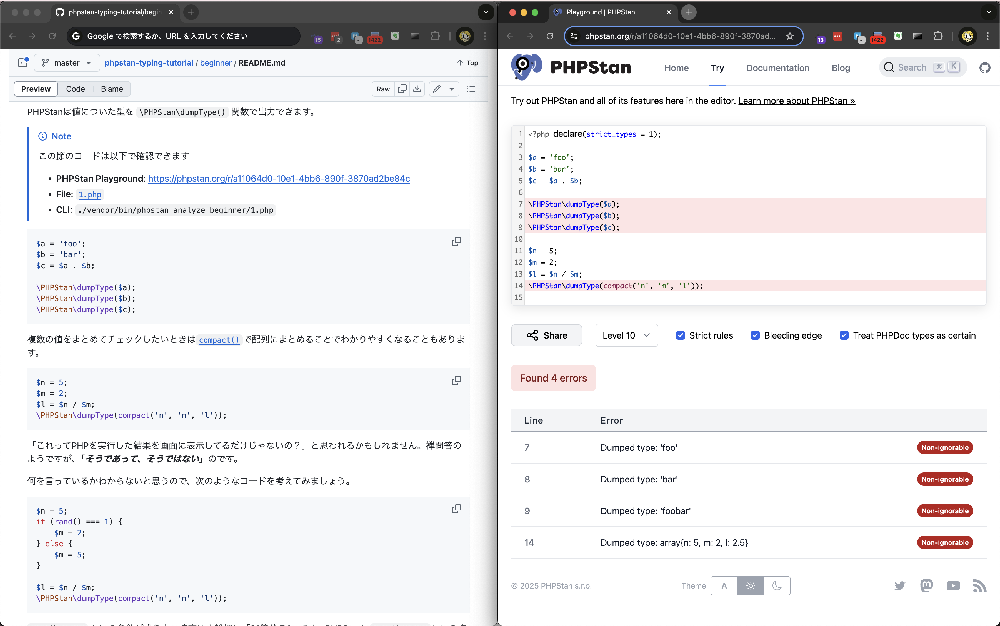

# PHPStan型付けチュートリアル

PHPStanを使った型付けをWebブラウザ上で体験できるチュートリアルです。

コード編集中にリアルタイムでPHPStanのフィードバックを得て「**PHPStanとペアプログラミングをする**」感覚を獲得してください。

## チュートリアル

 1. 🌱 [**PHPStan型付けチュートリアル 入門編**](beginner/README.md)
 2. 🔰 [**PHPStan型付けチュートリアル 基礎編**](basic/README.md) ***(工事中)***

## 取り組み方

チュートリアルには節見出しごとに、以下のようなブロックがあります。

> [!NOTE]
> この節のコードは以下で確認できます
> * **PHPStan Playground**: `https://phpstan.org/...`
> * **File**: `xxx.php`
> * **CLI**: `./vendor/bin/phpstan analyze beginner/xxx.php`

### 🖥️ Webブラウザで取り組む

チュートリアル本文にある **PHPStan Playground**: `https://phpstan.org/...` のリンクからWeb上のPlaygroundにアクセスできます。

Webブラウザのウィンドウを分割し、記事本文とPHPStan Playgroundを並べて表示すると便利です。

### ローカルで実行する

このGitリポジトリをローカルに `git clone` してください。

> [!TIP]
> PHP 8.0以降と[Composer]がインストールされている必要があります。  
> `git clone` 後にディレクトリ内に移動し `composer install` を実行してください。

#### 📜 エディタ上から実行する

チュートリアルを読み進めながら、同じディレクトリがあるファイルを編集してください。

> [!TIP]
> エディタ画面で編集中にPHPStanの出力を表示できるようにすることを **強く推奨** します。  
> **PhpStorm**、**VS Code**、**GNU Emacs**、**Vim**などでは拡張を有効化することで実現できます。

> [!WARNING]
> エディタ内からリアルタイムでPHPStanを実行する環境が用意できない場合は**Webブラウザを使ってください**。

[Composer]: https://getcomposer.org/

#### **非推奨** 🚫 ターミナルから実行する

このチュートリアルは、エディタ画面から透過的にPHPStanを実行することが理想です。

どうしても実行できない場合は端末から**CLI**で指定されている`./vendor/bin/phpstan analyze beginner/xxx.php`のようなコマンドを実行してください。

### 解答例

演習の解答例は [`answers/`](./answers/) にあります (例: `beginner/2.php` の解答例は [`answers/beginner/2.php`](./answers/beginner/2.php))。まずは自分で書いてみて、詰まったときに参照してください。

## 貢献するには

本文と演習ファイルの整合性は `composer check` で検査しています。書き方の詳細は [CONTRIBUTING.md](./CONTRIBUTING.md) を参照してください。

## Copyright

この文書は[GNU自由文書ライセンス]により自由に利用できます。

    Copyright (c)  2025 USAMI Kenta
    Permission is granted to copy, distribute and/or modify this document
    under the terms of the GNU Free Documentation License, Version 1.3
    or any later version published by the Free Software Foundation;
    with no Invariant Sections, no Front-Cover Texts, and no Back-Cover Texts.
    A copy of the license is included in the section entitled "GNU
    Free Documentation License".

コード部分については[BSD Zero Clause License]とします。

    BSD Zero Clause License
    
    Copyright (c)  2025 USAMI Kenta
    
    Permission to use, copy, modify, and/or distribute this software for any
    purpose with or without fee is hereby granted.
    
    THE SOFTWARE IS PROVIDED "AS IS" AND THE AUTHOR DISCLAIMS ALL WARRANTIES WITH
    REGARD TO THIS SOFTWARE INCLUDING ALL IMPLIED WARRANTIES OF MERCHANTABILITY
    AND FITNESS. IN NO EVENT SHALL THE AUTHOR BE LIABLE FOR ANY SPECIAL, DIRECT,
    INDIRECT, OR CONSEQUENTIAL DAMAGES OR ANY DAMAGES WHATSOEVER RESULTING FROM
    LOSS OF USE, DATA OR PROFITS, WHETHER IN AN ACTION OF CONTRACT, NEGLIGENCE OR
    OTHER TORTIOUS ACTION, ARISING OUT OF OR IN CONNECTION WITH THE USE OR
    PERFORMANCE OF THIS SOFTWARE.

[GNU自由文書ライセンス]: https://www.gnu.org/licenses/fdl-1.3.html
[gfdl-ja]: https://doclicenses.opensource.jp/GFDL-1.2/GFDL-1.2.html
[BSD Zero Clause License]: https://choosealicense.com/licenses/0bsd/
