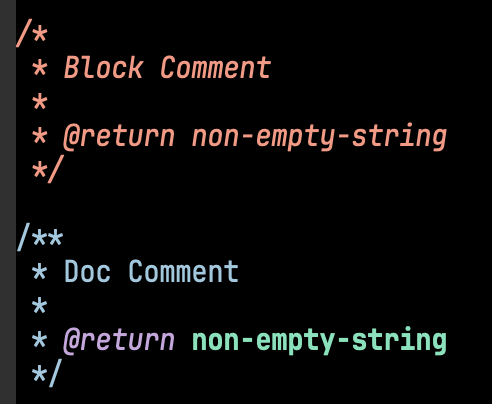

# PHPStan型付けチュートリアル 入門編

## 入門編のねらい

この入門編は、いままでPHPStanを使ったことがない方でも、「PHPStanがどのようにコードを分析しているか」の感覚を捉えるようになることが目的です。むしろ、「PHPStanにある程度馴染みはじめた」という方こそ「初めて聞いた」という内容があるかもしれません。

全ての機能を直ちに使いこなせるようになることはこの記事の目的ではありません。あなたが書いたコードに期待通りの型が付いているのか、付いていないのかを判別できるようになることが重要です。

## 1. 値の型を確認してみよう

PHPStanは値についた型を `\PHPStan\dumpType()` 関数で出力できます。

> [!NOTE]
> この節のコードは以下で確認できます
> * **PHPStan Playground**: <https://phpstan.org/r/a11064d0-10e1-4bb6-890f-3870ad2be84c>
> * **File**: [`1.php`](./1.php)
> * **CLI**: `./vendor/bin/phpstan analyze beginner/1.php`

```php
$a = 'foo';
$b = 'bar';
$c = $a . $b;
// . は文字列を結合する演算子

\PHPStan\dumpType($a);
\PHPStan\dumpType($b);
\PHPStan\dumpType($c);
```

複数の値をまとめてチェックしたいときは[`compact()`]で配列にまとめることでわかりやすくなることもあります。

```php
$n = 5;
$m = 2;
$l = $n / $m;
\PHPStan\dumpType(compact('n', 'm', 'l'));
```

「これってPHPを実行した結果を画面に表示してるだけじゃないの？」と思われるかもしれません。禅問答のようですが、「***そうであって、そうではない***」のです。

何を言っているかわからないと思うので、次のようなコードを考えてみましょう。

```php
$n = 5;
if (rand() === 1) {
    $m = 2;
} else {
    $m = 5;
}

$l = $n / $m;
\PHPStan\dumpType(compact('n', 'm', 'l'));
```

`rand() === 1` という条件が成り立つ確率は大雑把に「**21億分の1**」です。PHPStanは`rand() === 1`という確率的な処理は**行なっていません**。どちらでも僅かにでも可能性があるならば、PHPStanは**どちらの可能性もある**と判断して`2|5`という型をつけます。さらに`$l = $n / $m`という式はどうでしょうか。`$n`には`5`という型がついていますが、`$m`は`2`と`5`の可能性があるので、`$l = 5 / 2` (= `2.5`) と `$l = 5 / 5` (= `1`) という2パターンが考えられます。ここでPHPStanは`$l`に`1|2.5`という型をつけます。これはPHPStanが行なう型付けの特殊な例などではなく、***PHPStanが常に行なっていること***です。

> [!CAUTION]
> `\PHPStan\dumpType()` は静的解析時に用いられる擬似的な関数ですが、実行時に定義されません。
>
> 実アプリケーションでは実行する前、あるいはユニットテスト実行前に取り除いてください。

> [!TIP]
> * PHPのコードは文末に`;`が必要です
> * `.`演算子は文字列として結合します (`+`は常に数値の加算および配列マージを意味します)
> * * `/` 演算子は数値の除算(割り算)を行います

> [!IMPORTANT]
> 🔜 **コードを好きに書き換えてみて、納得できたら次に進んでください**

## 2. 型宣言で関数に型をつける

> [!NOTE]
> この節のコードは以下で確認できます
> * **PHPStan Playground**: <https://phpstan.org/r/f95fa83b-1216-46a1-9631-98a4736c5544>
> * **File**: [`2.php`](./2.php)
> * **CLI**: `./vendor/bin/phpstan analyze beginner/2.php`

PHPの関数に型を付けてみましょう。

```php
function label($title)
{
    return "label:{$title}";
}

\PHPStan\Testing\assertType('string', label('foo'));
```

> [!TIP]
> `\PHPStan\Testing\assertType(expected, actual)` は値が期待する型とPHPStanが認識している型の **文字列表現の一致** をチェックする関数です。`expected`と`actual`が同じ文字列なら何も出力されなくなります。
>
> ここでは使っていませんが、部分型関係を用いてチェックする `\PHPStan\Testing\assertSuperType(expected, actual)`もあります。

> [!TIP]
> 型宣言を含まない関数 `function f($arg1, $arg2) { ... }` は、どんな型の引数も受け入れ、どんな型の値を返すこともできます。
>
> * `function f(int $arg1, float $arg2) { ... }`
>   * `()`内に`type $arg`と書くことで、パラメータの型を宣言します
> * `function f($arg1, $arg2): int|float { ... }`
>   * `()` の次に `: type` と書くことで、戻り値の型を宣言します
>
> パラメータと戻り値の型宣言は組み合わせることができます。

PHPではパラメータ(仮引数リスト)や戻り値に型宣言を追加できます。関数やメソッドで型宣言された型は、実行時に**必ず保証**されます。

保証されるということは次のことを意味します：

 * パラメータで宣言された型は、実装内で必ず制約を満たします
   * ⇒ **制約を満たさない値が渡されることを心配する必要はありません**
 * 呼び出した結果、必ず宣言された型の制約を満たす戻り値が返されます
   * ⇒ **制約を満たさない値が返されることを心配する必要はありません**

それぞれの箇所では、型宣言されたものが静的型付きであることが必ず保証されます。

> [!TIP]
> PHPの型宣言についてどのように振る舞うかチェックできます
> * [php-playで確認する](https://php-play.dev/?c=DwfgDgFmAEAmCmBjANgQwE7wBQGcAu6AlongPp4CeY8OAvAIwCUA3AFCsBmArgHYmEB7HtDQAjeMlwFCPAObQAJHkJ5k8RgC5o%2BInNYBvVgEhMeLumEAiMRI36lKtQF9LbJ%2BwBuGUrC4BbMCwbSQByDgEBEMYWVi90H39A4KwmGKA&v=8.4&f=console)

> [!IMPORTANT]
> 🔜 **型を追加してエラーが出なくなったら次に進んでください**

## 3. 型を絞り込む

> [!NOTE]
> この節のコードは以下で確認できます
> * **PHPStan Playground**: <https://phpstan.org/r/aaa28500-8f05-4fff-b53c-97e1d74f708a>
> * **File**: [`3.php`](./3.php)
> * **CLI**: `./vendor/bin/phpstan analyze beginner/3.php`

ユーザーがフォームから検索して、結果の書籍一覧を表示する画面を考えてみましょう。

`search()`関数の実装は次のようになっています。

```php
/**
 * @param non-empty-string $word
 * @param 'asc'|'desc' $order
 * @param positive-int $page
 * @return list<Book>
 */
function search(string $word, string $order, int $page): array
{
    // 本来は検索エンジンからデータを取得する
    return match ($page) {
        1 => [new Book('', [])],
        default => [],
    };
}
```

`/** … */`は**Doc comment**といい、関数やクラスの説明を記述できます。 `@param`や`@return`のような記述は**PHPDocタグ**と呼びます。`@param`はパラメータの詳細な型を、`@return`は関数・メソッドの戻り値の型を記述します。

 * `@param non-empty-string $word`
   * 空文字列での検索は不正なので、関数呼び出し側の責任でチェックする
   * `non-empty-string`とは、`''`(空文字列)以外の文字列のことです
 * `@param 'asc'|'desc' $order`
   * 検索結果を昇順と降順のどちらに並び変えるか
 * `@param positive-int $page`
   * 検索のページ数：最小値は`1`
 * `@return list<Book>`
   * `Book`クラスのリスト
   * [`list`型について](https://scrapbox.io/php/list%E5%9E%8B)

> [!WARNING]
> Doc commentは、必ず `/** ... */` (`*`が二つ！)から始まります。  
> 範囲コメントの `/* ... */` とは区別されるので十分に気をつけてください。
>
> エディタによってはPHPDocタグが色付けされるかによって区別できます。
> 

続いて、外部からの入力を値として取得します。

```php
$word = filter_var($_GET['word'] ?? '');
$order = filter_var($_GET['order'] ?? 'asc');
$page = filter_var($_GET['page'] ?? 1, FILTER_VALIDATE_INT);

$books = search($word, $order, $page);
// 初期状態では以下のエラーが発生する
// Parameter #1 $word of function search expects non-empty-string, string|false given.
// Parameter #2 $order of function search expects 'asc'|'desc', string|false given.
// Parameter #3 $page of function search expects int<1, max>, int|false given.
```

> [!TIP]
> * [`filter_var()`](https://www.php.net/filter_var)
>   * 値をフィルタリングする関数です (名前に反して変数以外もフィルタできます)
>   * PHPStanは[検証フィルタ]とオプションによって型が変わります

PHPStanは比較により**型を絞り込む**(type narrowing)ことができます。
コードに以下のようなコードを追加して型を確認してみてください。

```php
$word = filter_var($_GET['word'] ?? '');
\PHPStan\dumpType($word); // DumpedType: string|false

if ($word === '' || $word === false) {
    \PHPStan\dumpType($word); // DumpedType: ''|false
} else {
    \PHPStan\dumpType($word); // DumpedType: non-empty-string
}

\PHPStan\dumpType($word); // DumpedType: string|false
```

PHPStanは**制御フロー解析**を実装しており、`if`や`foreach`といった制御構造に従った変数スコープを保持しています。上記のコードでは初期状態で`string|false`だった変数が`if`と`else`でそれぞれ`''|false`と`non-empty-string`に分岐し、合流後は`string|false`に**戻っている**ことが確認できます。

型が絞り込まれた状態で制御フローを中断することで、その型を絞り込めます。中断とは、`return` `throw` `continue` `break` `exit` あるいは `never` 型の関数を読み込むなどです。

```php
$word = filter_var($_GET['word'] ?? '');
\PHPStan\dumpType($word); // DumpedType: string|false

if ($word === '' || $word === false) {
    throw new RangeException('$word を入力してください');
} else {
    \PHPStan\dumpType($word); // DumpedType: non-empty-string
}

\PHPStan\dumpType($word); // DumpedType: non-empty-string
```

これで型が絞り込まれた`else`の状態で固定できました。`else`のコードはまるごと削除しても構いません。さらに、型の絞り込みは**式の内部**でも起こります。

```php
// strlen() に false を渡してしまう可能性があるのでエラー
if (strlen($word) === 0 || $word === false) {
// Parameter #1 $string of function strlen expects string, string|false given.
    throw new RangeException('$word を入力してください');
}
```

これは `||` の右辺と左辺を入れ替えることで解決します。

```php
// false のときに左辺で処理が打ち切られるので strlen() の呼び出しを防げる
if ($word === false || strlen($word) === 0) {
```

もっとも、このパターンは[`in_array()`](https://www.php.net/in_array)関数を用いて簡潔に絞り込めます。

```php
if (in_array($word, [false, ''], true)) {
    throw new RangeException('$word を入力してください');
}
```

このように`in_array($var, ['foo', 'bar', 'buz'], true)`と書くことで、`$var === 'foo' || $var === 'bar' || $var === 'buz'`と等価になり、PHPStanも型の絞り込みを適切に認識します。

同じように、ほかの変数`$order`と`$page`の型も絞り込んでみてください。

> [!IMPORTANT]
> 🔜 **実装を修正してエラーが出なくなったら次に進んでください**
> * `search()`を呼び出す際に渡す値の型を適切に絞り込みます
> * `search()`の実装内部でエラーが出ないように適当な値を埋めてください

## 4. 型宣言で安全に型をつける

一方で、**ファイル単位**で `declare(strict_types=1);` の有無によって、スカラー型について「関数(メソッド)を呼び出す際の引数(argument, 実引数)」および「関数(メソッド)が返す戻り値の型」の振る舞いが変わります。

 * `strict_types=1`**あり**
   * 値と型が一致しないと`TypeError`を送出します
 * `strict_types=1`**なし** (または`0`)
   * [**関数のコンテクスト**][関数のコンテクスト]における型の相互変換を行い、文脈に沿わない値に`TypeError`を発生します

以下のようなコードを考えてみましょう。

> [!NOTE]
> この節のコードは以下で確認できます
> * **PHPStan Playground**: <https://phpstan.org/r/af94aa2f-0cb7-4ed3-99de-34fe92eeeba5>
> * **File**: [`4.php`](./4.php)
> * **CLI**: `./vendor/bin/phpstan analyze beginner/4.php`

```php
<?php declare(strict_types = 0);

/**
 * $s が数値文字列だったら int に変換して返す
 */
function to_int(string $s): ?int
{
    try {
        return $s;
    } catch (TypeError) {
        return null;
    }
}

\PHPStan\Testing\assertType('int', to_int('1'));
\PHPStan\Testing\assertType('int', to_int('1.1'));
\PHPStan\Testing\assertType('null', to_int('php'));
\PHPStan\Testing\assertType('int|null', to_int(random_bytes(1)));
```

このコードは「**現実には動作するのにPHPStanが警告する**」代表的な例だと言えます。ただ、このコードはPHPStanで警告するだけでなく、`declare(strict_types=0)`に依存しているため安定しているとは言いがたいでしょう。

単に以下のようにすれば問題は解決するでしょうか。

```php
function to_int(string $s): ?int
{
    return (int)$s;
}
```

`(int)`キャストは入力値が数値文字列でなかったときにエラーも出さないため、基本的には適切ではありません。一方で`filter_var($var, FILTER_VALIDATE_INT)`や`filter_var($var, FILTER_VALIDATE_FLOAT)`は数値文字列として適切ではない文字列が返されたときに`false`を返します。

これらの検証をうまく組み合わせることで、適切な値を返す関数が実装できます。一方で、`assertType()`で表明したような型は実現できていません。

```php
\PHPStan\Testing\assertType('int', to_int('1'));
\PHPStan\Testing\assertType('int', to_int('1.1'));
\PHPStan\Testing\assertType('null', to_int('php'));
\PHPStan\Testing\assertType('int|null', to_int(random_bytes(1)));
```

PHPStanは**条件付き戻り値型**をサポートしているのでPHPDocタグに以下のように記述できます。

```php
 * @return ($s is numeric-string ? int : null)
```

条件付き戻り値型はPHPStan 2.1現在、`($param is T ? X : Y)`または`($param is not T ? Y : X)`のように記述できます。外側の`()`は省略できません。また、条件付き戻り値型の`X`と`Y`の部分は***どんな型も***ネストして書けます。もちろん`()`で括る必要はありますが、条件付き戻り値型をネストすることもできます。

引数で渡した値が「確実に`T`である」というときは`X`、「確実に`T`ではない」という場合は`Y`が戻り値になります。`$param: ?T`や`$param: T|U`のように型が絞り込まれていないければ、自動で`X|Y`になります。

`'1'`や`'1.1'`は定数で確実に数値文字列ですので、`int`という型を返してよいということになります。一方、`'php'`という文字列は間違っても数値ではないので、確実に`null`が返るということができます。「`$s :string`だがnumericかどうかはわからない」という時は自動で`?int`になります。

> [!TIP]
> 今回はとても大雑把に型をつけていますが、「数値文字列」ではなく「整数を表す文字列」だけをサポートしたい場合などはPHPStan 2.1時点ではPHPDocだけでは判定できず、PHPStan拡張を実装する必要があります。
> この章ではこのような使い方ができるということだけを認識できれば目的達成です。

> [!IMPORTANT]
> 🔜 **実装と型宣言を修正してエラーが出なくなれば、この章は修了です🎉**

## 入門編の修了

🎉 修了おめでとうございます！

ここまで学んだことを整理しましょう。

 * `\PHPStan\dumpType()`でPHPStanが認識している型を確認できる
   * `\PHPStan\Testing\assertType()`で期待する型との比較もできる
 * PHPの基本機能で関数・メソッドに型を付けることができる
 * PHPStanは制御フロー解析により型を絞り込める
 * PHPでは実行できるがPHPStanが受け付けないコードも存在することを認識できる
 * PHPDocタグでより詳細な型を付けることができる
 * `declare(strict_types=1)`の有無での振る舞いの差異がわかる
 * `filter_var()`を使った型の検査方法がわかる
 * 条件付き戻り値型の存在を認識している

ここまでできれば、細かい理窟は抜きにして「PHPStanを使える」と言って差し支えないと思います。

もちろん全ての機能を直ちに使いこなせるようになっている必要はありません。とはいえ、コードを書いて期待通りの型がついていない原因をチェックできるようになったといえるでしょう。

より詳細なPHPStanの使い方を身に付けるために次のステップに進みましょう！

[関数のコンテクスト]: https://www.php.net/manual/ja/language.types.type-juggling.php#language.types.type-juggling.function
[`compact()`]: https://www.php.net/compact
[検証フィルタ]: https://www.php.net/manual/ja/filter.filters.validate.php
